# 🏟️ Turf Connect Pro

> **A Modern, Full-Stack Turf Booking & Tournament Management Platform**

[](https://reactjs.org/)
[](https://www.typescriptlang.org/)
[](https://nodejs.org/)
[](https://supabase.com/)
[](https://tailwindcss.com/)

**Turf Connect Pro** is a comprehensive platform connecting sports enthusiasts with turf facilities. Players can discover turfs, book slots, join tournaments, and chat with owners — all in a beautifully designed, modern interface.

---

## 📑 Table of Contents

- [✨ Features](#-features)
- [🎯 Key Highlights](#-key-highlights)
- [🏗️ Architecture](#️-architecture)
- [🎨 UI/UX Design](#-uiux-design)
- [💻 Tech Stack](#-tech-stack)
- [📊 Database Schema](#-database-schema)
- [🚀 Getting Started](#-getting-started)
- [📁 Project Structure](#-project-structure)
- [🔑 Environment Variables](#-environment-variables)
- [🎮 User Roles](#-user-roles)
- [📱 Pages & Features](#-pages--features)
- [🔌 API Endpoints](#-api-endpoints)
- [💳 Payment Integration](#-payment-integration)
- [💬 Real-Time Chat](#-real-time-chat)
- [🏆 Tournament System](#-tournament-system)
- [🔐 Authentication](#-authentication)
- [🧪 Testing](#-testing)
- [🚢 Deployment](#-deployment)
- [🤝 Contributing](#-contributing)
- [📝 License](#-license)

---

## ✨ Features

### For Players 🎮

- **🔍 Browse Turfs**: Discover nearby turfs with advanced filtering (location, sport, price)
- **📅 Smart Booking**: Visual slot selection with date picker and real-time availability
- **💰 Secure Payments**: Integrated Razorpay payment gateway with instant confirmation
- **🏆 Tournaments**: Join competitive sports tournaments with team management
- **💬 Pre-Booking Chat**: Ask questions to turf owners before making any payment
- **📱 Real-Time Notifications**: Get instant updates via Socket.IO
- **⭐ Reviews & Ratings**: Share experiences and read authentic reviews
- **🎟️ Verification Codes**: Receive unique entry codes for bookings
- **📊 Dashboard**: Track bookings, tournaments, and payments in one place

### For Turf Owners (Clients) 🏟️

- **➕ Add Turfs**: List your facilities with images, pricing, and amenities
- **🗺️ Location Preview**: Interactive Google Maps integration with live preview
- **⏰ Slot Management**: Create, update, and manage time slots dynamically
- **🏆 Host Tournaments**: Organize sports events with automated registration
- **💬 Customer Communication**: Chat with players for queries and support
- **💸 Revenue Tracking**: Monitor earnings and booking analytics
- **📈 Dashboard Insights**: View booking trends, popular slots, and performance metrics
- **📸 Gallery Management**: Showcase your turf with multiple images

### For Admins 👨‍💼

- **👥 User Management**: Manage players, clients, and permissions
- **💰 Payment Oversight**: Track all transactions and commission splits
- **📊 Analytics Dashboard**: Platform-wide metrics and insights
- **✉️ Contact Management**: Handle user queries and support requests

---

## 🎯 Key Highlights

### 🌟 Modern User Interface
- **Neon Green Theme**: Vibrant, eye-catching design with gradient effects
- **Glass Morphism**: Frosted glass effects for cards and panels
- **Smooth Animations**: Micro-interactions for enhanced user engagement
- **Fully Responsive**: Works flawlessly on mobile, tablet, and desktop
- **Dark Mode Ready**: Optimized for low-light viewing

### ⚡ Performance Optimized
- **Lazy Loading**: Images and components load on-demand
- **Code Splitting**: Efficient bundling with Vite
- **Caching Strategy**: Smart API response caching
- **Optimized Queries**: Indexed database queries for speed

### 🔒 Security First
- **JWT Authentication**: Secure token-based auth with refresh tokens
- **Password Hashing**: Bcrypt encryption for user passwords
- **OTP Verification**: Email-based 2FA for account security
- **Rate Limiting**: Protection against brute force attacks
- **SQL Injection Prevention**: Parameterized queries throughout
- **XSS Protection**: Input sanitization and validation

---

## 🏗️ Architecture


### Request Flow

1. **User Action** → Frontend React Component
2. **API Call** → Axios HTTP Request
3. **Authentication** → JWT Verification Middleware
4. **Business Logic** → Controller Functions
5. **Database Query** → Supabase Client
6. **Response** → JSON sent back to frontend
7. **UI Update** → React State Management

---

## 🎨 UI/UX Design

### Design System

#### Color Palette

```css
/* Primary - Neon Green */
--primary: 142 76% 36%        /* hsl(142, 76%, 36%) - #10b981 */
--primary-foreground: 0 0% 100%

/* Secondary - Dark Gray */
--secondary: 240 4% 16%       /* hsl(240, 4%, 16%) - #27272a */
--secondary-foreground: 0 0% 100%

/* Background */
--background: 240 10% 4%      /* hsl(240, 10%, 4%) - #09090b */
--foreground: 0 0% 98%        /* hsl(0, 0%, 98%) - #fafafa */

/* Accent - Highlighted Elements */
--accent: 142 76% 36%
--accent-foreground: 0 0% 100%

/* Destructive - Errors */
--destructive: 0 84% 60%      /* Red */
--destructive-foreground: 0 0% 100%
```

#### Typography

- **Headings**: Inter (Google Fonts)
- **Body Text**: System fonts for performance
- **Special**: Outfit for hero sections

#### Components Library (shadcn/ui)

```
├── Accordion         ├── Badge           ├── Button
├── Card              ├── Checkbox        ├── Dialog
├── Dropdown Menu     ├── Input           ├── Label
├── Navigation Menu   ├── Popover         ├── Progress
├── Radio Group       ├── Scroll Area     ├── Select
├── Separator         ├── Slider          ├── Switch
├── Tabs              ├── Textarea        ├── Toast
└── Tooltip
```

### UI Elements

#### 1. **Navbar**
- Sticky header with glass effect
- Dynamic menu based on user role
- Profile dropdown with avatar
- Mobile-responsive hamburger menu

#### 2. **Hero Section**
- Full-height landing with gradient background
- Animated call-to-action buttons
- Rotating testimonials
- Particle effects (optional)

#### 3. **Cards**
- **Turf Cards**: Image carousel, rating stars, quick actions
- **Tournament Cards**: Status badges, team count, prize pool
- **Dashboard Cards**: Stats with icons, gradient backgrounds

#### 4. **Forms**
- Floating labels
- Inline validation with Zod
- Error messages with icons
- Submit button loading states

#### 5. **Tables**
- Sortable columns
- Pagination with page size options
- Search/filter functionality
- Action menus per row

#### 6. **Modals**
- Smooth slide-in animations
- Backdrop blur effect
- Keyboard accessibility (ESC to close)
- Focus trap for accessibility

---

## 💻 Tech Stack

### Frontend

| Technology | Version | Purpose |
|------------|---------|---------|
| **React** | 18.3.1 | UI library for component-based architecture |
| **TypeScript** | 5.8.3 | Type-safe JavaScript for better DX |
| **Vite** | 5.4.19 | Lightning-fast build tool and dev server |
| **React Router** | 6.30.1 | Client-side routing and navigation |
| **Tailwind CSS** | 3.4.17 | Utility-first CSS framework |
| **shadcn/ui** | Latest | Accessible, customizable component library |
| **Radix UI** | Latest | Unstyled, accessible UI primitives |
| **Axios** | 1.13.2 | HTTP client for API requests |
| **Socket.IO Client** | 4.8.3 | Real-time bidirectional communication |
| **Lucide React** | 0.462.0 | Beautiful, consistent icon set |
| **React Hook Form** | 7.61.1 | Performant form state management |
| **Zod** | 3.25.76 | TypeScript-first schema validation |
| **Recharts** | 2.15.4 | Composable charting library |
| **date-fns** | 3.6.0 | Modern date utility library |

### Backend

| Technology | Version | Purpose |
|------------|---------|---------|
| **Node.js** | 18+ | JavaScript runtime environment |
| **Express.js** | 5.2.1 | Web application framework |
| **Supabase** | 2.88.0 | PostgreSQL database and auth |
| **Socket.IO** | 4.8.3 | Real-time WebSocket server |
| **Razorpay** | 2.9.6 | Payment gateway integration |
| **JWT** | 9.0.3 | JSON Web Tokens for authentication |
| **Bcrypt** | 6.0.0 | Password hashing and salting |
| **Nodemailer** | 7.0.12 | Email sending service |
| **Multer** | 1.4.5 | File upload middleware |
| **CORS** | 2.8.5 | Cross-Origin Resource Sharing |
| **Express Rate Limit** | 8.2.1 | API rate limiting |
| **dotenv** | 17.2.3 | Environment variable management |

### Database

- **PostgreSQL** (via Supabase)
  - 15 tables covering users, turfs, bookings, payments, tournaments, chat
  - Full-text search capabilities
  - Row-level security policies
  - Automated backups
  - Real-time subscriptions

### DevOps & Tools

- **Git** - Version control
- **npm** - Package management
- **ESLint** - Code linting
- **Prettier** - Code formatting
- **Nodemon** - Auto-restart during development

---

## 📊 Database Schema

### Core Tables (15 Total)

#### 1. **users** - User Accounts
```sql
├── id (UUID, PK)
├── name (text)
├── email (text, unique)
├── password (text, hashed)
├── role (text) - player | client | admin
├── phone (text)
├── profile_image_url (text)
├── email_verified (boolean)
├── created_at (timestamptz)
```

#### 2. **turfs** - Turf Listings
```sql
├── id (UUID, PK)
├── owner_id (UUID, FK → users)
├── name (text)
├── location (text)
├── description (text)
├── price_per_slot (numeric)
├── facilities (text)
├── images (text[])
├── rating (numeric, computed)
├── reviews_count (integer, computed)
├── owner_phone (text)
├── google_maps_link (text)
├── is_active (boolean)
```

#### 3. **slots** - Time Slots
```sql
├── id (UUID, PK)
├── turf_id (UUID, FK → turfs)
├── date (date)
├── start_time (time)
├── end_time (time)
├── price (numeric)
├── is_booked (boolean)
```

#### 4. **bookings** - Slot Reservations
```sql
├── id (UUID, PK)
├── user_id (UUID, FK → users)
├── slot_id (UUID, FK → slots)
├── turf_id (UUID, FK → turfs)
├── status (text) - pending | confirmed | cancelled
├── total_amount (numeric)
├── razorpay_order_id (text)
├── created_at (timestamptz)
```

#### 5. **payments** - Transactions
```sql
├── id (UUID, PK)
├── booking_ids (uuid[])
├── user_id (UUID, FK → users)
├── amount (numeric)
├── status (text) - pending | success | failed
├── razorpay_payment_id (text)
├── razorpay_signature (text)
```

#### 6. **tournaments** - Sports Events
```sql
├── id (UUID, PK)
├── turf_id (UUID, FK → turfs)
├── name (text)
├── sport (text)
├── start_date (date)
├── end_date (date)
├── entry_fee (numeric)
├── prize_pool (numeric)
├── max_teams (integer)
├── status (text) - upcoming | ongoing | completed
```

#### 7. **tournament_participants** - Team Registrations
```sql
├── id (UUID, PK)
├── tournament_id (UUID, FK → tournaments)
├── user_id (UUID, FK → users)
├── team_name (text)
├── team_members (text[])
├── leader_contact_phone (text)
├── payment_status (text)
```

#### 8. **chats** - Conversation Threads
```sql
├── id (UUID, PK)
├── owner_id (UUID, FK → users)
├── player_id (UUID, FK → users)
├── last_message (text)
├── is_deleted (boolean)
├── updated_at (timestamptz)
```

#### 9. **messages** - Chat Messages
```sql
├── id (UUID, PK)
├── chat_id (UUID, FK → chats)
├── sender_id (UUID, FK → users)
├── content (text)
├── is_read (boolean)
├── created_at (timestamptz)
```

#### 10. **reviews** - Turf Reviews
```sql
├── id (UUID, PK)
├── turf_id (UUID, FK → turfs)
├── user_id (UUID, FK → users)
├── rating (integer, 1-5)
├── comment (text)
├── created_at (timestamptz)
```

**Additional Tables**: `user_sessions`, `otp_verifications`, `booking_verification_codes`, `earnings`, `contact_messages`

> **Full Schema**: See [backend/schemainfo.md](backend/schemainfo.md) for complete details.

---

## 🚀 Getting Started

### Prerequisites

- **Node.js** 18.x or higher
- **npm** 9.x or higher
- **PostgreSQL** (via Supabase account)
- **Razorpay Account** (for payments)
- **SMTP Email** (for OTP emails)

### Installation

#### 1. Clone the Repository

```bash
git clone https://github.com/yourusername/turf-connect-pro.git
cd turf-connect-pro
```

#### 2. Backend Setup

```bash
cd backend
npm install
```

Create `.env` file:

```env
# Database
SUPABASE_URL=your_supabase_project_url
SUPABASE_KEY=your_supabase_anon_key

# JWT
JWT_SECRET=your_super_secret_jwt_key_min_32_characters
JWT_REFRESH_SECRET=your_refresh_token_secret

# Razorpay
RAZORPAY_KEY_ID=your_razorpay_test_key
RAZORPAY_KEY_SECRET=your_razorpay_secret

# Email (Nodemailer)
EMAIL_USER=your_email@gmail.com
EMAIL_PASS=your_app_password

# Server
PORT=5000
NODE_ENV=development
```

Start the backend:

```bash
npm run dev
```

Server runs on `http://localhost:5000`

#### 3. Frontend Setup

```bash
cd ../frontend
npm install
```

Create `.env` file:

```env
VITE_API_BASE_URL=http://localhost:5000/api
VITE_GOOGLE_MAPS_API_KEY=your_google_maps_api_key_optional
```

Start the frontend:

```bash
npm run dev
```

Frontend runs on `http://localhost:5173`

#### 4. Database Setup

Run the schema SQL file:

```bash
# In Supabase SQL Editor, run:
# backend/config/optimized_schema.sql
```

Or use the migration scripts provided in `backend/config/`

---

## 📁 Project Structure

```
turf-connect-pro/
│
├── backend/                    # Express.js Backend
│   ├── config/                 # Database schemas, configs
│   │   ├── db.js              # Supabase client
│   │   ├── optimized_schema.sql
│   │   └── ...
│   ├── controllers/            # Business logic
│   │   ├── authController.js
│   │   ├── turfController.js
│   │   ├── bookingController.js
│   │   ├── paymentController.js
│   │   ├── tournamentController.js
│   │   ├── chatController.js
│   │   └── ...
│   ├── middleware/             # Auth, error handling
│   │   └── authMiddleware.js
│   ├── routes/                 # API routes
│   │   ├── authRoutes.js
│   │   ├── turfRoutes.js
│   │   ├── bookingRoutes.js
│   │   └── ...
│   ├── uploads/                # File uploads
│   ├── server.js               # Express server + Socket.IO
│   ├── package.json
│   └── .env
│
├── frontend/                   # React + TypeScript Frontend
│   ├── public/                 # Static assets
│   │   ├── logo.svg
│   │   └── favicon.ico
│   ├── src/
│   │   ├── components/         # Reusable components
│   │   │   ├── layout/
│   │   │   │   ├── Navbar.tsx
│   │   │   │   └── Footer.tsx
│   │   │   ├── ui/             # shadcn/ui components
│   │   │   ├── chat/
│   │   │   ├── home/
│   │   │   └── turfs/
│   │   ├── pages/              # Route pages
│   │   │   ├── HomePage.tsx
│   │   │   ├── LoginPage.tsx
│   │   │   ├── RegisterPage.tsx
│   │   │   ├── TurfsPage.tsx
│   │   │   ├── TurfDetailPage.tsx
│   │   │   ├── TournamentsPage.tsx
│   │   │   ├── ChatPage.tsx
│   │   │   ├── ProfilePage.tsx
│   │   │   ├── client/
│   │   │   │   ├── ClientDashboard.tsx
│   │   │   │   ├── AddTurfPage.tsx
│   │   │   │   ├── TurfSlotsPage.tsx
│   │   │   │   └── AddTournamentPage.tsx
│   │   │   └── player/
│   │   │       └── PlayerDashboard.tsx
│   │   ├── services/           # API service layer
│   │   │   ├── api.ts
│   │   │   ├── authService.ts
│   │   │   ├── turfService.ts
│   │   │   ├── bookingService.ts
│   │   │   └── ...
│   │   ├── types/              # TypeScript types
│   │   │   └── index.ts
│   │   ├── lib/                # Utilities
│   │   │   └── utils.ts
│   │   ├── App.tsx             # Main app component
│   │   ├── main.tsx            # Entry point
│   │   └── index.css           # Global styles
│   ├── package.json
│   ├── vite.config.ts
│   ├── tailwind.config.ts
│   ├── tsconfig.json
│   └── .env
│
├── DATABASE_SETUP_INSTRUCTIONS.md
├── QUICK_START_GUIDE.md
├── README.md
└── .git/
```

---

## 🔑 Environment Variables

### Backend (.env)

| Variable | Description | Example |
|----------|-------------|---------|
| `SUPABASE_URL` | Supabase project URL | `https://xyz.supabase.co` |
| `SUPABASE_KEY` | Supabase anon key | `eyJhbGciOiJIUzI1NiIsInR5cCI6...` |
| `JWT_SECRET` | Secret for access tokens | `your_secret_key_min_32_chars` |
| `JWT_REFRESH_SECRET` | Secret for refresh tokens | `another_secret_key` |
| `RAZORPAY_KEY_ID` | Razorpay API key | `rzp_test_xxxxx` |
| `RAZORPAY_KEY_SECRET` | Razorpay secret | `xxxxxxxxxxxxx` |
| `EMAIL_USER` | SMTP email address | `noreply@yourapp.com` |
| `EMAIL_PASS` | SMTP password/app password | `your_app_password` |
| `PORT` | Server port | `5000` |
| `NODE_ENV` | Environment | `development` or `production` |

### Frontend (.env)

| Variable | Description | Example |
|----------|-------------|---------|
| `VITE_API_BASE_URL` | Backend API URL | `http://localhost:5000/api` |
| `VITE_GOOGLE_MAPS_API_KEY` | Google Maps API key (optional) | `AIzaSyBxxxx...` |

---

## 🎮 User Roles

### 1. Player 🎮

**Access:**
- Browse and book turfs
- Join tournaments
- Chat with turf owners
- Manage profile and bookings
- Write reviews

**Dashboard:**
- Upcoming bookings
- Tournament registrations
- Payment history
- Favorite turfs

### 2. Turf Owner (Client) 🏟️

**Access:**
- Add and manage turfs
- Create time slots
- Host tournaments
- View bookings and revenue
- Chat with players

**Dashboard:**
- Turf analytics
- Booking calendar
- Revenue reports
- Customer messages

### 3. Admin 👨‍💼

**Access:**
- All platform data
- User management
- Payment oversight
- Content moderation
- System analytics

**Dashboard:**
- Platform statistics
- Revenue tracking
- User activity logs
- Support tickets

---

## 📱 Pages & Features

### Public Pages

#### 1. **Home Page** (`/`)
- Hero section with search
- Featured turfs carousel
- Statistics counter (animated)
- Testimonials
- How it works section
- FAQ accordion
- Contact form

#### 2. **Browse Turfs** (`/turfs`)
- Grid/list view toggle
- Filters: location, sport, price range
- Sort: price, rating, newest
- Pagination
- Quick view modal

#### 3. **Turf Detail** (`/turfs/:id`)
- Image gallery (carousel)
- Location map (Google Maps embed)
- Facilities grid
- Date picker (next 7 days)
- Slot selection (multi-select)
- Booking summary sidebar
- Reviews and ratings
- Pre-booking chat button

#### 4. **Tournaments** (`/tournaments`)
- Tournament cards with status badges
- Filter by sport, city, date
- Registration modal
- Team member input
- Payment integration

#### 5. **About Us** (`/about`)
- Company story
- Team profiles
- Mission and values

#### 6. **Contact** (`/contact`)
- Contact form with validation
- Office location map
- Email, phone, social links

### Authentication Pages

#### 7. **Login** (`/login`)
- Email + password
- "Remember me" checkbox
- Forgot password link
- Social login (future)

#### 8. **Register** (`/register`)
- Role selection (player/client)
- Form validation with Zod
- Email verification
- Terms acceptance

#### 9. **Forgot Password** (`/forgot-password`)
- Email OTP verification
- New password set
- Success redirect

### User Pages

#### 10. **Player Dashboard** (`/player/dashboard`)
- **Overview**: Upcoming bookings, tournaments joined
- **Bookings Tab**: List with status, verification codes
- **Tournaments Tab**: Registered tournaments
- **Payments Tab**: Transaction history
- **Statistics**: Total bookings, spend, reviews

#### 11. **Client Dashboard** (`/client/dashboard`)
- **Overview**: Total turfs, bookings, revenue
- **My Turfs Tab**: Turf list with edit/delete
- **Bookings Tab**: Incoming bookings
- **Tournaments Tab**: Hosted tournaments
- **Analytics**: Charts, graphs, trends

#### 12. **Add Turf** (`/client/add-turf`)
- Name, location, description
- Price per slot
- Facilities (multi-select)
- Image upload (multiple)
- Google Maps link with live preview
- Submit button

#### 13. **Add Tournament** (`/client/add-tournament`)
- Tournament details
- Date range picker
- Entry fee, prize pool
- Max teams, sport type
- Tournament image upload

#### 14. **Manage Slots** (`/client/turfs/:id/slots`)
- Date selector
- Slot creation (bulk)
- Edit/delete slots
- Price override

#### 15. **Chat Page** (`/chat`)
- Conversation list (sidebar)
- Message window
- Real-time updates (Socket.IO)
- Message read status
- Delete conversation (owner only)

#### 16. **Profile** (`/profile`)
- Avatar upload
- Edit name, email, phone
- Change password
- Delete account

---

## 🔌 API Endpoints

### Authentication

```
POST   /api/auth/register          # Register new user
POST   /api/auth/login             # Login user
POST   /api/auth/logout            # Logout user
POST   /api/auth/refresh           # Refresh access token
POST   /api/auth/forgot-password   # Send password reset OTP
POST   /api/auth/verify-otp        # Verify OTP
POST   /api/auth/reset-password    # Reset password
GET    /api/auth/verify-token      # Verify JWT token
```

### Users & Profile

```
GET    /api/profile                # Get user profile
PUT    /api/profile                # Update profile
PUT    /api/profile/password       # Change password
DELETE /api/profile                # Delete account
```

### Turfs

```
GET    /api/turfs                  # Get all turfs (with filters)
GET    /api/turfs/:id              # Get turf details
POST   /api/turfs                  # Create turf (client only)
PUT    /api/turfs/:id              # Update turf (owner only)
DELETE /api/turfs/:id              # Delete turf (owner only)
GET    /api/turfs/my               # Get my turfs (client)
GET    /api/turfs/:id/gallery      # Get turf gallery
GET    /api/turfs/:id/reviews      # Get turf reviews
POST   /api/turfs/:id/reviews      # Add review
POST   /api/turfs/upload-images    # Upload turf images
```

### Slots

```
GET    /api/slots/turf/:turfId     # Get slots by turf
POST   /api/slots                  # Create slots (client only)
PUT    /api/slots/:id              # Update slot
DELETE /api/slots/:id              # Delete slot
```

### Bookings

```
GET    /api/bookings               # Get all bookings (filtered by user)
GET    /api/bookings/:id           # Get booking details
POST   /api/bookings/create-and-order  # Create booking + Razorpay order
PUT    /api/bookings/:id/status    # Update booking status
DELETE /api/bookings/:id           # Cancel booking
```

### Payments

```
POST   /api/payments/verify        # Verify Razorpay payment
GET    /api/payments/:id           # Get payment details
GET    /api/payments/user          # Get user payments
```

### Tournaments

```
GET    /api/tournaments             # Get all tournaments
GET    /api/tournaments/:id         # Get tournament details
POST   /api/tournaments             # Create tournament (client)
PUT    /api/tournaments/:id         # Update tournament
DELETE /api/tournaments/:id         # Delete tournament
POST   /api/tournaments/:id/join    # Join tournament
GET    /api/tournaments/:id/participants  # Get participants
POST   /api/tournaments/:id/payment # Process tournament payment
```

### Chat

```
GET    /api/chat/conversations     # Get user conversations
POST   /api/chat/conversations     # Create conversation
GET    /api/chat/:chatId/messages  # Get chat messages
POST   /api/chat/:chatId/messages  # Send message
DELETE /api/chat/:chatId           # Delete chat (owner only)
POST   /api/chat/:chatId/favorite  # Toggle favorite
```

### Contact

```
POST   /api/contact                # Submit contact form
```

> **Authentication**: All user endpoints require `Authorization: Bearer <token>` header.

---

## 💳 Payment Integration

### Razorpay Setup

1. **Create Account**: Sign up at [razorpay.com](https://razorpay.com)
2. **Get API Keys**:
   - **Test Mode**: `rzp_test_xxxxx`
   - **Live Mode**: `rzp_live_xxxxx`
3. **Add to Backend `.env`**:
   ```env
   RAZORPAY_KEY_ID=rzp_test_xxxxx
   RAZORPAY_KEY_SECRET=your_secret_key
   ```

### Payment Flow

```mermaid
sequenceDiagram
    participant P as Player
    participant F as Frontend
    participant B as Backend
    participant R as Razorpay
    participant DB as Database

    P->>F: Select slots & click "Pay"
    F->>B: POST /bookings/create-and-order
    B->>DB: Create booking (pending)
    B->>R: Create Razorpay order
    R-->>B: Return order_id
    B-->>F: Return { key_id, order, booking_ids }
    F->>R: Open Razorpay modal
    P->>R: Enter card details
    R->>R: Process payment
    R-->>F: Payment success (payment_id, signature)
    F->>B: POST /payments/verify
    B->>B: Verify signature
    B->>DB: Update booking → confirmed
    B->>DB: Create payment record
    B-->>F: Success response
    F->>P: Show success + redirect to dashboard
```



### Test Cards

| Card Number | Expiry | CVV | Result |
|-------------|--------|-----|--------|
| 4111 1111 1111 1111 | Any future | Any 3 digits | Success |
| 4012 8888 8888 1881 | Any future | Any 3 digits | Success |
| 5555 5555 5555 4444 | Any future | Any 3 digits | Mastercard Success |

---

## 💬 Real-Time Chat

### Socket.IO Integration

#### Events

**Client → Server**

```javascript
socket.emit('join_chat', chatId);           // Join chat room
socket.emit('leave_chat', chatId);          // Leave chat room
socket.emit('send_message', { chatId, content });  // Send message
```

**Server → Client**

```javascript
socket.on('receive_message', (message) => {
  // Handle incoming message
});

socket.on('user_typing', ({ userId }) => {
  // Show typing indicator
});
```

### Chat Architecture

```
1. Player clicks "Chat" on turf detail page
2. Frontend calls POST /api/chat/conversations
3. Backend creates/retrieves conversation
4. Player navigates to /chat?chat={chatId}
5. Socket.IO connection established
6. Client emits 'join_chat' event
7. Messages load from database
8. Real-time messages via Socket.IO
```

---

## 🏆 Tournament System

### Features

- **Registration**: Team-based with leader contact
- **Payment**: Integrated Razorpay for entry fees
- **Verification**: 6-digit codes for tournament entry
- **Management**: Host can view participants, update status
- **Filtering**: Search by sport, city, date range

### Tournament States

1. **Upcoming**: Registration open, spots available
2. **Ongoing**: Tournament in progress
3. **Completed**: Results finalized

---

## 🔐 Authentication

### JWT Strategy

- **Access Token**: 15 minutes expiry
- **Refresh Token**: 7 days expiry
- **Storage**: `localStorage` (access), HTTP-only cookie (refresh - future)

### Middleware

```javascript
// backend/middleware/authMiddleware.js
const authMiddleware = (req, res, next) => {
  const token = req.headers.authorization?.split(' ')[1];
  if (!token) return res.status(401).json({ error: 'Unauthorized' });
  
  try {
    const decoded = jwt.verify(token, process.env.JWT_SECRET);
    req.user = decoded;
    next();
  } catch (error) {
    res.status(401).json({ error: 'Invalid token' });
  }
};
```

### OTP Email Verification

- 6-digit OTP sent via Nodemailer
- 10-minute expiry
- 5 max attempts per OTP
- Rate limited to 1 OTP per minute per email

---

## 🧪 Testing

### Manual Testing Checklist

**Authentication**
- [ ] Register new user (player & client)
- [ ] Email verification with OTP
- [ ] Login with valid credentials
- [ ] Login with invalid credentials (should fail)
- [ ] Forgot password flow
- [ ] Token refresh

**Turf Booking**
- [ ] Browse turfs with filters
- [ ] View turf detail page
- [ ] Select multiple slots
- [ ] Complete payment (test mode)
- [ ] Verify booking confirmation
- [ ] Check verification code generation

**Chat**
- [ ] Initiate chat before booking
- [ ] Send messages
- [ ] Receive real-time messages
- [ ] Delete conversation (owner)

**Tournament**
- [ ] Create tournament (client)
- [ ] Join tournament (player)
- [ ] Payment for entry fee
- [ ] View participants

**Responsive Design**
- [ ] Test on mobile (375px)
- [ ] Test on tablet (768px)
- [ ] Test on desktop (1920px)

### API Testing

Use tools like **Postman** or **Thunder Client**:

```bash
# Example: Login request
POST http://localhost:5000/api/auth/login
Content-Type: application/json

{
  "email": "test@example.com",
  "password": "password123"
}
```

---

## 🚢 Deployment

### Backend Deployment (Node.js)

**Recommended Platforms:**
- **Render** (free tier available)
- **Railway**
- **Heroku**
- **DigitalOcean App Platform**

**Steps:**

1. Set environment variables in platform
2. Connect GitHub repository
3. Deploy from `main` branch
4. Set build command: `npm install`
5. Set start command: `npm start`

### Frontend Deployment (React)

**Recommended Platforms:**
- **Vercel** (recommended)
- **Netlify**
- **Cloudflare Pages**

**Steps:**

1. Connect GitHub repository
2. Set build command: `npm run build`
3. Set output directory: `dist`
4. Set environment variables (VITE_API_BASE_URL)
5. Deploy

### Database (Supabase)

Supabase automatically handles:
- Hosting
- Backups
- Scaling
- SSL certificates

### Environment Variables (Production)

Don't forget to update:
- `NODE_ENV=production`
- Use production Razorpay keys
- Update CORS origins
- Set secure JWT secrets

---

## 🤝 Contributing

Contributions are welcome! Please follow these steps:

1. Fork the repository
2. Create a feature branch (`git checkout -b feature/AmazingFeature`)
3. Commit your changes (`git commit -m 'Add some AmazingFeature'`)
4. Push to the branch (`git push origin feature/AmazingFeature`)
5. Open a Pull Request

### Code Style

- Follow ESLint rules
- Use TypeScript for frontend
- Write meaningful commit messages
- Add comments for complex logic

---

## 📝 License

This project is licensed under the **ISC License**.

---

## 📞 Support

For issues, questions, or suggestions:

- **Email**: support@turfconnectpro.com
- **GitHub Issues**: [Create an issue](https://github.com/yourusername/turf-connect-pro/issues)
- **Documentation**: See `QUICK_START_GUIDE.md` and `DATABASE_SETUP_INSTRUCTIONS.md`

---

## 🙏 Acknowledgments

- **shadcn/ui** for the beautiful component library
- **Radix UI** for accessible primitives
- **Lucide** for the icon set
- **Razorpay** for payment gateway
- **Supabase** for database and backend services
- **Vercel** for hosting

---

## 📈 Project Stats

- **Total Files**: 150+
- **Lines of Code**: 20,000+
- **Components**: 50+
- **API Endpoints**: 40+
- **Database Tables**: 15

---

Made with ❤️ by **Ankit** | © 2026 Turf Connect Pro
